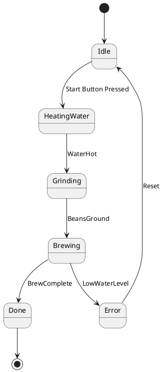
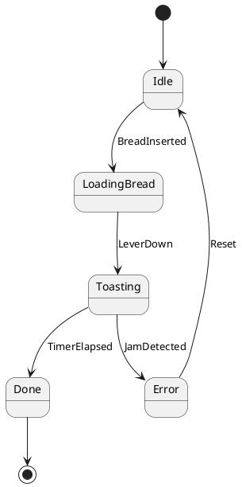

# Chapter 1: Making coffee process

```plantuml
@startuml
    [*] --> Idle
    Idle --> HeatingWater : Start Button Pressed
    HeatingWater --> Grinding : WaterHot
    Grinding --> Brewing : BeansGround
    Brewing --> Done : BrewComplete
    Brewing --> Error : LowWaterLevel
    Error --> Idle : Reset
    Done --> [*]
@enduml
```

# Chapter 2: Making toast process

```plantuml
@startuml
[*] --> Idle
Idle --> LoadingBread : BreadInserted
LoadingBread --> Toasting : LeverDown
Toasting --> Done : TimerElapsed
Toasting --> Error : JamDetected
Error --> Idle : Reset
Done --> [*]
@enduml
```