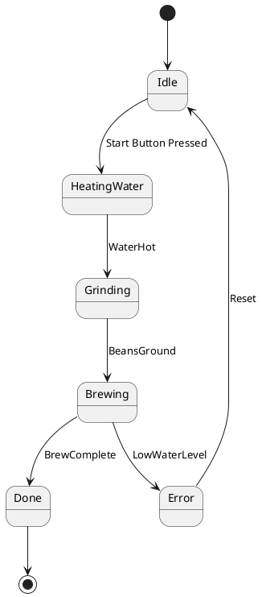

# Chapter 1

```plantuml
@startuml
    [*] --> Idle
    Idle --> HeatingWater : Start Button Pressed
    HeatingWater --> Grinding : WaterHot
    Grinding --> Brewing : BeansGround
    Brewing --> Done : BrewComplete
    Brewing --> Error : LowWaterLevel
    Error --> Idle : Reset
    Done --> [*]
@enduml
```