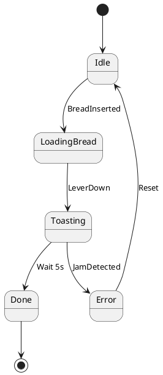

# Chapter 2: Making toast process

```plantuml
@startuml
[*] --> Idle
Idle --> LoadingBread : BreadInserted
LoadingBread --> Toasting : LeverDown
Toasting --> Done : Wait 5s
Toasting --> Error : JamDetected
Error --> Idle : Reset
Done --> [*]
@enduml
```