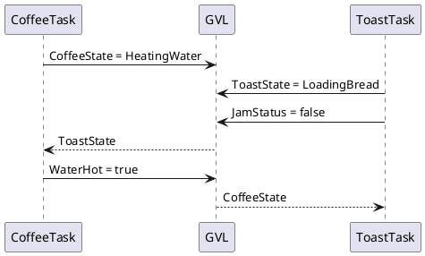

# Chapter 3: Task communication

```plantuml
@startuml
participant CoffeeTask
participant GVL
participant ToastTask

CoffeeTask -> GVL: CoffeeState = HeatingWater
ToastTask -> GVL: ToastState = LoadingBread

ToastTask -> GVL: JamStatus = false
GVL --> CoffeeTask: ToastState

CoffeeTask -> GVL: WaterHot = true
GVL --> ToastTask: CoffeeState
@enduml
```