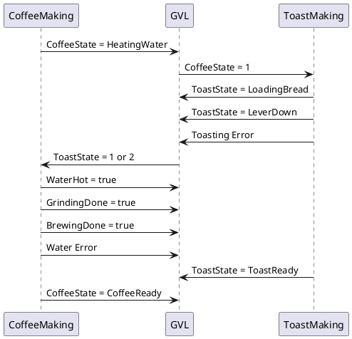

# Chapter 3: Task communication

```plantuml
@startuml
participant CoffeeMaking
participant GVL
participant ToastMaking

CoffeeMaking -> GVL: CoffeeState = HeatingWater
GVL -> ToastMaking: CoffeeState = 1
ToastMaking -> GVL: ToastState = LoadingBread
ToastMaking -> GVL: ToastState = LeverDown
ToastMaking -> GVL: Toasting Error

GVL -> CoffeeMaking: ToastState = 1 or 2

CoffeeMaking -> GVL: WaterHot = true
CoffeeMaking -> GVL: GrindingDone = true
CoffeeMaking -> GVL: BrewingDone = true
CoffeeMaking -> GVL: Water Error
ToastMaking -> GVL: ToastState = ToastReady
CoffeeMaking -> GVL: CoffeeState = CoffeeReady
@enduml
```